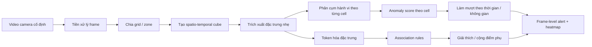
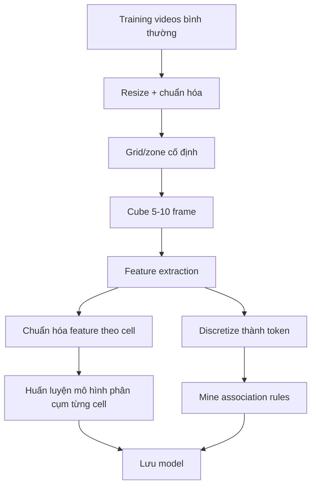
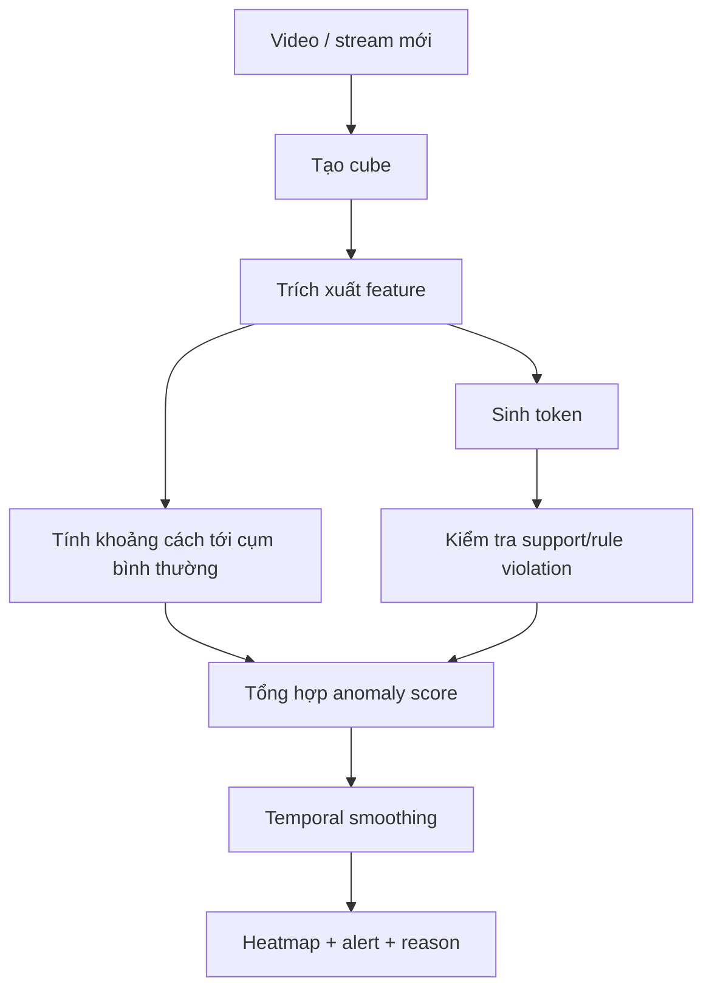

# PRD - Phát hiện hành vi bất thường theo ngữ cảnh trên camera giám sát dựa trên phân cụm hành vi-không gian-thời gian và khai phá luật kết hợp

## 1. Tổng quan

### 1.1. Tên dự án

**Phát hiện hành vi bất thường theo ngữ cảnh trên camera giám sát dựa trên phân cụm hành vi-không gian-thời gian và khai phá luật kết hợp**.

Tên tiếng Anh tham khảo: **Context-Aware Abnormal Behavior Detection using Spatio-Temporal Behavior Clustering and Association Rule Mining**.

### 1.2. Bối cảnh

Trong hệ thống camera giám sát, phần lớn thời gian video chỉ chứa các hoạt động bình thường lặp đi lặp lại. Với camera cố định, cùng một vùng trong khung hình thường có các mẫu chuyển động ổn định:

- vỉa hè thường có người đi bộ;
- làn đường thường có phương tiện di chuyển;
- cổng ra vào thường có người đứng hoặc di chuyển chậm;
- ban ngày và ban đêm có mật độ, ánh sáng và mức nhiễu khác nhau.

Ý tưởng của dự án là tận dụng tính lặp lại này để học các mẫu hành vi bình thường theo từng vùng của camera. Khi xuất hiện chuyển động lệch khỏi cụm hành vi đã học, hoặc một tổ hợp ngữ cảnh hiếm/không hợp lý theo các luật kết hợp, hệ thống sẽ gán điểm bất thường và sinh cảnh báo.

Dự án tham khảo tư duy giải quyết bài toán từ Lu et al. trong bài báo **"Abnormal Event Detection at 150 FPS in MATLAB"**, đặc biệt là cách nhìn camera cố định như một nguồn dữ liệu có cấu trúc không gian-thời gian lặp lại. Paper này chỉ được dùng như tài liệu tham khảo về tư duy tiền xử lý, chia vùng và học mẫu bình thường; dự án không đặt mục tiêu sao chép, tái hiện hoặc làm giàu thêm phương pháp của paper đó.

### 1.3. Mục tiêu học tập và nghiên cứu

Mục tiêu chính của đề tài là học hỏi và tìm hiểu sâu về:

- tiền xử lý dữ liệu video giám sát;
- biểu diễn hành vi bằng đặc trưng không gian-thời gian;
- phân cụm hành vi bình thường theo vùng camera;
- rời rạc hóa đặc trưng liên tục thành token/item;
- khai phá luật kết hợp bằng Apriori hoặc FP-Growth;
- kết hợp kết quả phân cụm và luật kết hợp để phát hiện, giải thích hành vi bất thường.

Đề tài ưu tiên tính rõ ràng, khả năng phân tích và khả năng giải thích hơn việc đạt hiệu năng cao nhất trên benchmark.

### 1.4. Mục tiêu sản phẩm thử nghiệm

Xây dựng một pipeline phát hiện bất thường cho camera cố định có khả năng:

- học các mẫu chuyển động bình thường theo từng vùng trong khung hình;
- tính điểm bất thường cho từng vùng và từng frame/cube;
- phát hiện các hành vi như di chuyển sai vùng, hướng lạ, tốc độ lạ, mật độ lạ hoặc chuyển động không phù hợp với thời điểm;
- tạo heatmap bất thường trên video;
- sinh lý do cảnh báo ở dạng dễ hiểu bằng token/rule;
- chạy đủ nhanh cho xử lý gần thời gian thực trên video giám sát.

### 1.5. Nguyên tắc thiết kế

Hệ thống không cố nhận diện ngữ nghĩa phức tạp ngay từ đầu. Thay vào đó, hệ thống ưu tiên các tín hiệu rẻ, ổn định và có thể học từ dữ liệu bình thường:

- chuyển động;
- hướng;
- mật độ;
- vị trí;
- độ sáng;
- thời điểm;
- cụm hành vi bình thường.

Hai trụ cột nghiên cứu của hệ thống là **phân cụm hành vi-không gian-thời gian** và **khai phá luật kết hợp**. Phân cụm cung cấp điểm lệch định lượng so với mẫu bình thường; luật kết hợp cung cấp ngữ cảnh, khả năng giải thích và tín hiệu phát hiện các tổ hợp hành vi hiếm. Trong triển khai, không nên để một luật đơn lẻ quyết định toàn bộ cảnh báo; kết quả cuối nên tổng hợp cả độ lệch cụm, độ hiếm của token và mức vi phạm luật.

---

## 2. Vấn đề cần giải quyết

### 2.1. Vấn đề nghiệp vụ

Người vận hành camera phải theo dõi lượng video lớn trong thời gian dài. Các hành vi bất thường thường hiếm, ngắn và dễ bị bỏ sót. Một hệ thống tự động cần giúp:

- lọc ra các thời điểm đáng chú ý;
- chỉ ra vùng bất thường trong khung hình;
- giảm số cảnh báo giả;
- giải thích lý do cảnh báo ở mức người vận hành có thể hiểu.

### 2.2. Vấn đề kỹ thuật

Phát hiện bất thường trong video không phải bài toán phân loại thông thường vì:

- khó liệt kê toàn bộ loại bất thường có thể xảy ra;
- dữ liệu bất thường ít và không cân bằng;
- cùng một hành vi có thể bình thường ở vùng này nhưng bất thường ở vùng khác;
- điều kiện ánh sáng, bóng đổ, nhiễu và mật độ đám đông làm đặc trưng chuyển động biến động;
- xử lý từng frame bằng mô hình nặng có thể không phù hợp yêu cầu real-time.

### 2.3. Giả định chính

MVP dựa trên các giả định sau:

- camera cố định hoặc gần như cố định;
- cảnh giám sát có cấu trúc không gian ổn định;
- dữ liệu huấn luyện chủ yếu chứa hành vi bình thường;
- hành vi bất thường biểu hiện qua chuyển động, vị trí, mật độ, hướng hoặc tổ hợp ngữ cảnh khác thường;
- không yêu cầu nhận diện danh tính cá nhân.

---

## 3. Người dùng và giá trị

### 3.1. Người dùng mục tiêu

- Nhân viên an ninh;
- người vận hành trung tâm camera;
- quản lý tòa nhà, bãi xe, hành lang, cổng ra vào, khu vực công cộng;
- nhóm nghiên cứu thị giác máy tính và khai phá dữ liệu;
- sinh viên triển khai đề tài phát hiện bất thường trong video.

### 3.2. Giá trị mang lại

- Giảm tải việc quan sát liên tục;
- phát hiện sớm các hành vi đáng chú ý;
- tạo heatmap giúp biết bất thường xảy ra ở đâu;
- có giải thích bằng token/rule thay vì chỉ trả về điểm số;
- có thể học riêng cho từng camera mà không cần bộ nhãn bất thường lớn;
- phù hợp triển khai baseline nhanh trước khi dùng mô hình deep learning nặng hơn.

---

## 4. Phạm vi sản phẩm

### 4.1. Phạm vi MVP

MVP tập trung vào:

- video từ camera cố định;
- xử lý video ghi sẵn trước, sau đó có thể mở rộng sang stream;
- chia frame thành grid hoặc zone cố định;
- tạo spatio-temporal cube ngắn từ 5-10 frame;
- trích xuất đặc trưng chuyển động nhẹ;
- học mô hình phân cụm hành vi bình thường theo từng cell/zone;
- tính anomaly score theo cell và frame;
- hiển thị heatmap bất thường;
- tạo token và rule để giải thích cảnh báo.

### 4.2. Loại bất thường MVP cần bắt

- Chuyển động quá nhanh ở vùng thường chậm;
- chuyển động sai hướng hoặc ngược hướng phổ biến;
- mật độ chuyển động bất thường;
- vùng thường yên tĩnh bỗng có chuyển động lớn;
- đối tượng/chuyển động có kích thước hoặc tốc độ không phù hợp với vùng;
- mẫu chuyển động không thuộc cụm bình thường của vùng đó;
- tổ hợp token hiếm, ví dụ `zone=sidewalk` + `motion=very_fast` + `object_size=large`.

### 4.3. Ngoài phạm vi MVP

- Nhận diện danh tính người;
- nhận diện biển số xe;
- phân loại chi tiết hành vi như đánh nhau, trộm cắp, bỏ quên đồ;
- tracking đa đối tượng chính xác trong đám đông;
- học liên camera;
- suy luận ý định;
- xử lý camera rung mạnh hoặc thay đổi góc nhìn liên tục;
- dashboard vận hành hoàn chỉnh.

---

## 5. Kiến trúc hệ thống

### 5.1. Kiến trúc tổng quát



### 5.2. Luồng huấn luyện offline



### 5.3. Luồng suy luận online/offline



---

## 6. Thành phần chức năng

### 6.1. Module Input Video

#### Mục tiêu

Đọc video từ dataset hoặc file camera và cung cấp frame tuần tự cho pipeline.

#### Yêu cầu

- Đọc được `.avi`, `.mp4`, chuỗi ảnh `.jpg/.png/.tif`;
- hỗ trợ dataset CUHK Avenue, UCSD Ped1/Ped2, ShanghaiTech nếu có sẵn;
- giữ thông tin `video_id`, `frame_id`, `timestamp`;
- cho phép giới hạn số frame để debug nhanh.

#### Đầu ra

```text
FrameRecord {
  video_id,
  frame_id,
  timestamp,
  frame_rgb,
  frame_gray
}
```

### 6.2. Module Tiền Xử Lý

#### Mục tiêu

Chuẩn hóa frame để giảm chi phí tính toán và giảm nhiễu.

#### Yêu cầu

- Resize về kích thước cấu hình được, ví dụ `320x240` hoặc `160x120`;
- chuyển grayscale;
- tùy chọn cân bằng sáng nhẹ;
- tùy chọn blur nhẹ để giảm nhiễu;
- giữ mapping từ frame resize về frame gốc để vẽ heatmap.

### 6.3. Module Grid/Zone

#### Mục tiêu

Chia frame thành các vùng cố định để học normal pattern riêng theo vị trí.

#### Yêu cầu

- Hỗ trợ grid đều, ví dụ `16x12`, `20x15`;
- hỗ trợ zone thủ công bằng file cấu hình trong giai đoạn sau;
- mỗi cell có `cell_id`, tọa độ, kích thước;
- có thể bỏ qua cell ít thông tin, ví dụ vùng tường/trời.

#### Cấu hình mẫu

```yaml
grid:
  rows: 12
  cols: 16
  ignore_cells: []
```

### 6.4. Module Spatio-Temporal Cube

#### Mục tiêu

Gom thông tin nhiều frame liên tiếp để phát hiện chuyển động thay vì chỉ phân tích frame đơn.

#### Yêu cầu

- Cube gồm `T=5` hoặc `T=10` frame;
- stride cấu hình được, ví dụ `1`, `2`, `5`;
- mỗi cube gắn với một cell/zone cố định;
- hỗ trợ multi-scale trong giai đoạn mở rộng nếu cần nghiên cứu thêm.

### 6.5. Module Feature Extraction

#### Mục tiêu

Tạo vector đặc trưng nhẹ, đủ mô tả chuyển động và ngữ cảnh vùng.

#### Feature bắt buộc cho MVP

```text
foreground_ratio
motion_magnitude_mean
motion_magnitude_std
direction_hist_8bins
motion_density
brightness_mean
brightness_delta
cell_row
cell_col
cell_id
```

#### Feature tùy chọn

```text
object_size_estimate
edge_energy
gradient_3d_energy
flow_consistency
time_bucket
```

#### Phương pháp motion

MVP có thể bắt đầu bằng:

- frame differencing;
- background subtraction MOG2;
- optical flow Farneback nếu cần hướng chuyển động tốt hơn.

Khuyến nghị triển khai:

1. Baseline nhanh: frame differencing + motion density.
2. Baseline tốt hơn: Farneback optical flow + direction histogram.
3. Feature nâng cao: 3D gradient trên cube để khảo sát thêm đặc trưng không gian-thời gian.

### 6.6. Module Phân Cụm Hành Vi-Không Gian-Thời Gian

#### Mục tiêu

Học các cụm hành vi bình thường riêng cho từng cell/zone dựa trên đặc trưng không gian-thời gian.

#### Thuật toán MVP

Ưu tiên **MiniBatchKMeans theo từng cell** vì dễ triển khai, chạy nhanh và dễ giải thích.

Quy trình:

1. Với mỗi cell, gom feature từ training video bình thường.
2. Chuẩn hóa feature bằng mean/std riêng của cell.
3. Huấn luyện KMeans với `K=3..8`.
4. Tính phân phối khoảng cách từ feature training tới centroid gần nhất.
5. Lưu percentile distance làm ngưỡng anomaly.

#### Thuật toán mở rộng để so sánh

- Gaussian Mixture Model;
- Isolation Forest;
- One-Class SVM;
- DBSCAN/HDBSCAN nếu muốn khảo sát cụm tự nhiên và outlier;
- K-Medoids nếu muốn mẫu đại diện là điểm dữ liệu thật, dễ giải thích.

### 6.7. Module Tokenization

#### Mục tiêu

Biến feature liên tục thành token rời rạc để khai phá luật và giải thích.

#### Ví dụ token

```text
cell=08_05
zone=sidewalk
motion=slow
direction=left_to_right
density=low
brightness=day_like
cluster=C3
```

#### Yêu cầu

- Rời rạc hóa tốc độ thành `still`, `slow`, `medium`, `fast`, `very_fast`;
- rời rạc hóa hướng thành 8 hướng hoặc nhóm hướng chính;
- rời rạc hóa mật độ thành `low`, `medium`, `high`;
- rời rạc hóa độ sáng thành `dark`, `normal`, `bright`;
- thêm `cluster=Cx` từ mô hình phân cụm;
- không tạo quá nhiều token khiến luật bị vụn.

### 6.8. Module Association Rules

#### Mục tiêu

Tìm các tổ hợp token phổ biến trong dữ liệu bình thường để hỗ trợ giải thích và cộng điểm bất thường.

#### Thuật toán

- FP-Growth là lựa chọn ưu tiên nếu số transaction lớn;
- Apriori dùng được cho thí nghiệm nhỏ.

#### Chỉ số luật

- `support`;
- `confidence`;
- `lift`;
- số lần xuất hiện theo cell/zone.

#### Ví dụ luật

```text
{cell=08_05, brightness=day_like} -> {motion=slow}
{cell=10_03, density=low} -> {direction=left_to_right}
{zone=entrance, density=high} -> {motion=still_or_slow}
```

#### Vai trò trong MVP

Luật kết hợp là một thành phần nghiên cứu chính của đề tài, dùng để học quan hệ giữa vùng, thời điểm, hướng, mật độ, tốc độ và cụm hành vi. Trong phát hiện bất thường, luật nên được kết hợp với kết quả phân cụm thay vì dùng đơn độc. Chúng dùng để:

- giải thích vì sao một mẫu bị xem là lạ;
- phát hiện tổ hợp token hiếm;
- cộng thêm điểm nếu rule mạnh bị vi phạm;
- hỗ trợ phân tích định tính trong báo cáo.

### 6.9. Module Anomaly Scoring

#### Mục tiêu

Tính điểm bất thường liên tục cho từng cell/cube và tổng hợp thành điểm frame.

#### Thành phần điểm

```text
cluster_distance_score:
  độ xa so với cụm bình thường gần nhất của cell

temporal_change_score:
  độ thay đổi đột ngột so với các cube gần trước đó

rare_token_score:
  mức hiếm của tổ hợp token trong dữ liệu training

rule_violation_score:
  mức vi phạm các luật có confidence/lift cao
```

#### Công thức MVP

```text
score = 0.65 * cluster_distance_score
      + 0.20 * temporal_change_score
      + 0.10 * rare_token_score
      + 0.05 * rule_violation_score
```

Trọng số có thể điều chỉnh qua validation. Nếu chưa có đủ rule ổn định, MVP có thể đặt:

```text
score = 0.80 * cluster_distance_score
      + 0.20 * temporal_change_score
```

#### Tổng hợp frame-level

```text
frame_score = mean(top_k_cell_scores)
```

hoặc:

```text
frame_score = max(cell_scores)
```

Khuyến nghị dùng `top_k mean` để giảm nhiễu từ một cell đơn lẻ.

### 6.10. Module Smoothing và Alert

#### Mục tiêu

Giảm cảnh báo giả do nhiễu từng frame/cube.

#### Yêu cầu

- Làm mượt score theo thời gian bằng moving average hoặc EMA;
- làm mượt nhẹ theo không gian giữa các cell lân cận;
- chỉ alert nếu score vượt ngưỡng trong `N` cube liên tiếp;
- sinh mức độ cảnh báo: `low`, `medium`, `high`.

#### Logic đề xuất

```text
if smoothed_frame_score > threshold_high for >= N frames:
    alert = high
elif smoothed_frame_score > threshold_medium for >= N frames:
    alert = medium
else:
    alert = none
```

### 6.11. Module Output và Visualization

#### Đầu ra bắt buộc

- `frame_score`;
- `cell_scores`;
- heatmap bất thường;
- danh sách cell bất thường;
- lý do cảnh báo dạng text;
- video/frame overlay kết quả.

#### Ví dụ output JSON

```json
{
  "video_id": "avenue_test_01",
  "frame_id": 352,
  "frame_score": 0.87,
  "severity": "high",
  "abnormal_cells": ["08_05", "08_06", "09_05"],
  "reasons": [
    "cell=08_05 has motion=very_fast while normal pattern is slow",
    "token combination {cell=08_05, motion=very_fast, density=high} has low support",
    "nearest normal cluster is C3 but distance is above the 99th percentile"
  ]
}
```

---

## 7. Yêu cầu chức năng

### 7.1. Bắt buộc cho MVP

- Đọc video hoặc chuỗi frame từ dataset;
- resize và chuẩn hóa frame;
- chia frame thành grid cố định;
- tạo cube 5-10 frame;
- trích xuất feature chuyển động nhẹ;
- huấn luyện mô hình phân cụm theo từng cell;
- tính anomaly score theo cell/cube;
- tổng hợp frame-level score;
- làm mượt score để giảm nhiễu;
- xuất heatmap bất thường;
- xuất file kết quả dạng JSON/CSV;
- tạo token từ feature;
- khai phá luật cơ bản từ training data;
- sinh lý do cảnh báo dựa trên cluster distance và token/rule.

### 7.2. Nên có

- CLI train/test rõ ràng;
- cấu hình bằng YAML;
- lưu model bằng pickle/joblib;
- script visualize overlay heatmap lên video;
- báo cáo FPS;
- báo cáo AUC/EER nếu dataset có ground truth;
- ablation giữa score có rule và không rule.

### 7.3. Có thể mở rộng sau

- Zone ngữ nghĩa do người dùng vẽ;
- multi-scale grid/pyramid để so sánh ảnh hưởng của độ phân giải vùng;
- thuật toán phân cụm khác như GMM, DBSCAN, K-Medoids;
- thuật toán khai phá mẫu tuần tự nếu muốn xét thứ tự thời gian mạnh hơn luật kết hợp;
- cập nhật model online;
- dashboard web;
- stream RTSP;
- cảnh báo theo cấp hành vi/đoạn thời gian thay vì chỉ theo frame-level;
- tích hợp detector nhẹ để ước lượng loại đối tượng.

---

## 8. Yêu cầu phi chức năng

### 8.1. Hiệu năng

- MVP nên xử lý tối thiểu 15 FPS ở độ phân giải resize trên CPU phổ thông;
- mục tiêu tốt: 25-30 FPS với frame differencing hoặc MOG2;
- optical flow có thể chậm hơn nhưng vẫn cần đủ nhanh cho thí nghiệm offline;
- huấn luyện offline chấp nhận chậm hơn suy luận.

### 8.2. Khả năng giải thích

Mỗi alert cần có ít nhất một lý do:

- lệch cụm bình thường;
- vượt percentile distance của cell;
- motion/density/direction bất thường;
- tổ hợp token hiếm;
- vi phạm rule mạnh.

### 8.3. Tính ổn định

- Không alert do một frame đơn lẻ nếu chưa qua smoothing;
- xử lý được cell ít chuyển động bằng fallback threshold;
- không crash khi video thiếu frame hoặc frame lỗi;
- log rõ số feature, số cell, số model được huấn luyện.

### 8.4. Tính mở rộng

- Module hóa theo `data`, `features`, `models`, `rules`, `scoring`, `visualization`;
- cấu hình được grid size, cube length, stride, thuật toán feature và thuật toán phân cụm;
- dễ thay KMeans bằng model khác.

---

## 9. Dữ liệu và đánh giá

### 9.1. Dataset ưu tiên trong workspace

Workspace hiện có các dataset phù hợp:

- CUHK Avenue;
- UCSD Ped1/Ped2;
- ShanghaiTech.

Khuyến nghị thứ tự:

1. **UCSD Ped2**: nhỏ hơn, dễ chạy baseline.
2. **CUHK Avenue**: có nhiều hành vi bất thường trực quan.
3. **ShanghaiTech**: đa cảnh, dùng sau khi pipeline ổn định.

### 9.2. Chia dữ liệu

Mặc định:

- training videos: dùng làm dữ liệu normal;
- testing videos: dùng để đánh giá anomaly;
- validation split từ training nếu cần chọn threshold.

### 9.3. Metric định lượng

- Frame-level ROC-AUC;
- frame-level PR-AUC;
- EER nếu cần so sánh với các báo cáo học thuật;
- false positive rate;
- recall tại một mức FPR cố định;
- FPS hoặc ms/frame;
- số cảnh báo/hành vi đúng và sai.

### 9.4. Đánh giá định tính

Cần lưu các ví dụ:

- phát hiện đúng với heatmap rõ;
- cảnh báo sai do ánh sáng/bóng/nhiễu;
- bỏ sót vì chuyển động quá nhỏ;
- rule giải thích tốt;
- rule gây hiểu sai.

---

## 10. Thí nghiệm và Ablation

### 10.1. Baseline bắt buộc

1. Motion magnitude threshold đơn giản.
2. Per-cell KMeans chỉ dùng motion feature.
3. Per-cell KMeans + temporal smoothing.
4. Per-cell KMeans + token/rule explanation.
5. Full score: cluster distance + temporal change + rare token + rule violation.

### 10.2. Ablation

- Không dùng cell-specific model, chỉ dùng model toàn cục;
- không dùng direction histogram;
- không dùng brightness/time token;
- không dùng temporal smoothing;
- không dùng rule score;
- thay `max cell score` bằng `top-k mean`;
- thay grid size `8x6`, `16x12`, `20x15`;
- thay cube length `5`, `10`, `15`.

### 10.3. Kỳ vọng kết quả

- Model theo từng cell phải tốt hơn model toàn cục;
- smoothing phải giảm false positive;
- rule/token có thể không tăng AUC mạnh nhưng phải tăng khả năng giải thích;
- grid quá nhỏ dễ nhiễu, grid quá lớn dễ mất chi tiết;
- optical flow nên phát hiện hướng tốt hơn frame differencing nhưng tốn thời gian hơn.

---

## 11. Thiết kế cấu hình

### 11.1. File cấu hình mẫu

```yaml
data:
  dataset: "ucsd_ped2"
  train_path: "dataset/UCSD_Anomaly_Dataset.v1p2/UCSDped2/Train"
  test_path: "dataset/UCSD_Anomaly_Dataset.v1p2/UCSDped2/Test"

video:
  resize_width: 320
  resize_height: 240
  grayscale: true

grid:
  rows: 12
  cols: 16

cube:
  length: 5
  stride: 1

features:
  motion_method: "farneback"
  direction_bins: 8
  use_brightness: true

model:
  type: "minibatch_kmeans"
  clusters_per_cell: 5
  min_samples_per_cell: 50

rules:
  enabled: true
  algorithm: "fpgrowth"
  min_support: 0.01
  min_confidence: 0.6
  min_lift: 1.1

scoring:
  cluster_weight: 0.65
  temporal_weight: 0.20
  rare_token_weight: 0.10
  rule_weight: 0.05
  top_k_cells: 5
  smoothing_window: 5
```

---

## 12. Giao diện dòng lệnh đề xuất

### 12.1. Train

```bash
python train.py --config configs/ucsd_ped2.yaml
```

Đầu ra:

```text
outputs/models/ucsd_ped2/
  config.yaml
  scalers.joblib
  cell_models.joblib
  thresholds.json
  rules.json
  feature_stats.json
```

### 12.2. Test

```bash
python test.py --config configs/ucsd_ped2.yaml --model outputs/models/ucsd_ped2
```

Đầu ra:

```text
outputs/results/ucsd_ped2/
  frame_scores.csv
  cell_scores.npz
  alerts.json
  metrics.json
```

### 12.3. Visualize

```bash
python visualize.py --video test_001 --results outputs/results/ucsd_ped2
```

Đầu ra:

```text
outputs/visualizations/ucsd_ped2/test_001_overlay.mp4
```

---

## 13. Rủi ro và giảm thiểu

### 13.1. Background subtraction nhiễu

**Rủi ro:** Ánh sáng, bóng đổ, mưa hoặc nén video tạo chuyển động giả.

**Giảm thiểu:** Dùng smoothing, bỏ qua cell có motion nhỏ không ổn định, thử optical flow, chuẩn hóa brightness và thêm threshold tối thiểu.

### 13.2. Rule quá vụn

**Rủi ro:** Quá nhiều token làm support thấp, luật khó tổng quát.

**Giảm thiểu:** Giới hạn số token, rời rạc hóa thô, lọc luật bằng support/confidence/lift, chỉ dùng rule làm tín hiệu phụ.

### 13.3. Support thấp không đồng nghĩa bất thường

**Rủi ro:** Hành vi hợp lệ nhưng hiếm bị báo bất thường.

**Giảm thiểu:** Rare token score chỉ chiếm trọng số nhỏ; alert cần cluster distance hoặc temporal change đủ cao.

### 13.4. Grid không khớp ngữ nghĩa cảnh

**Rủi ro:** Một cell chứa cả đường và vỉa hè, làm mẫu normal bị trộn.

**Giảm thiểu:** Thử grid nhỏ hơn, dùng zone thủ công ở giai đoạn sau, hoặc multi-scale.

### 13.5. Dữ liệu training chứa bất thường

**Rủi ro:** Model học nhầm bất thường thành bình thường.

**Giảm thiểu:** Lọc outlier trong training, dùng percentile robust, kiểm tra top distance trong training.

### 13.6. False positive từ camera noise

**Rủi ro:** Một cell đơn lẻ bị nhiễu gây alert.

**Giảm thiểu:** Dùng top-k mean, spatial smoothing, yêu cầu alert kéo dài nhiều frame.

---

## 14. Kế hoạch triển khai

### Giai đoạn 1 - Baseline xử lý video và feature

- Đọc dataset UCSD Ped2 hoặc Avenue;
- resize frame;
- chia grid;
- tạo cube;
- trích xuất frame difference hoặc optical flow feature;
- lưu feature theo `video_id`, `frame_id`, `cell_id`.

### Giai đoạn 2 - Phân cụm hành vi theo cell

- Chuẩn hóa feature theo cell;
- train MiniBatchKMeans;
- tính distance distribution;
- chọn threshold theo percentile;
- xuất cell score và frame score.

### Giai đoạn 3 - Visualization và đánh giá

- Tạo heatmap cell score;
- overlay lên frame/video;
- tính FPS;
- tính ROC-AUC nếu có ground truth;
- lưu ví dụ đúng/sai.

### Giai đoạn 4 - Token và association rules

- Discretize motion/density/direction/brightness;
- tạo transaction;
- chạy FP-Growth hoặc Apriori;
- lưu rules;
- tạo reason text cho alert.

### Giai đoạn 5 - Tổng hợp score và ablation

- Thêm rare token score;
- thêm rule violation score;
- tối ưu trọng số;
- so sánh với baseline không rule;
- viết báo cáo phân tích.

### Giai đoạn 6 - Mở rộng nghiên cứu sau MVP

- Thêm multi-scale pyramid;
- thử 3D gradient feature;
- thử thêm thuật toán phân cụm khác như GMM, DBSCAN, K-Medoids;
- thử thêm biến thể luật kết hợp và ngưỡng support/confidence/lift;
- so sánh tốc độ, khả năng giải thích và độ chính xác với KMeans baseline.

---

## 15. Tiêu chí hoàn thành MVP

MVP được xem là hoàn thành khi:

- huấn luyện được mô hình phân cụm hành vi trên ít nhất một dataset;
- test được trên video mới và sinh `frame_scores.csv`;
- tạo được heatmap overlay;
- có alert JSON với lý do cảnh báo;
- có ít nhất 3 thí nghiệm baseline/ablation;
- báo cáo được FPS và ít nhất một metric định lượng;
- code chạy lại được bằng config;
- tài liệu mô tả rõ pipeline, feature, model và scoring.

---

## 16. Kết quả bàn giao

- Source code pipeline;
- file cấu hình dataset;
- model đã train thử;
- kết quả score dạng CSV/JSON;
- video/frame visualization;
- báo cáo thực nghiệm;
- phân tích ưu/nhược điểm;
- phần thảo luận về paper Lu et al. như tài liệu tham khảo tư duy, không phải phương pháp cần tái hiện.

---

## 17. Định hướng dài hạn

Sau MVP, hệ thống có thể mở rộng theo các hướng:

- học online để thích nghi thay đổi theo thời gian;
- zone ngữ nghĩa do người dùng định nghĩa;
- kết hợp object detector nhẹ để phân biệt người/xe;
- phát hiện bất thường theo cấp hành vi/đoạn thời gian thay vì chỉ theo frame-level;
- thêm quan hệ giữa nhiều vùng liền kề;
- dùng mô hình deep feature cho cảnh phức tạp;
- triển khai dashboard realtime;
- đánh giá trên nhiều camera và nhiều điều kiện môi trường hơn.
