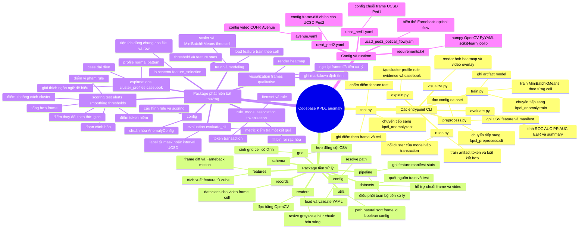
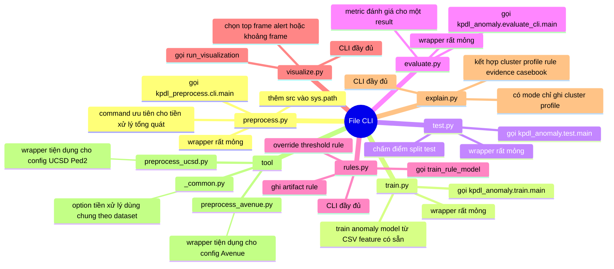
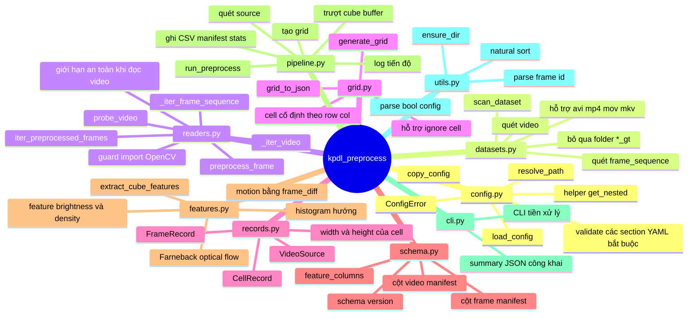
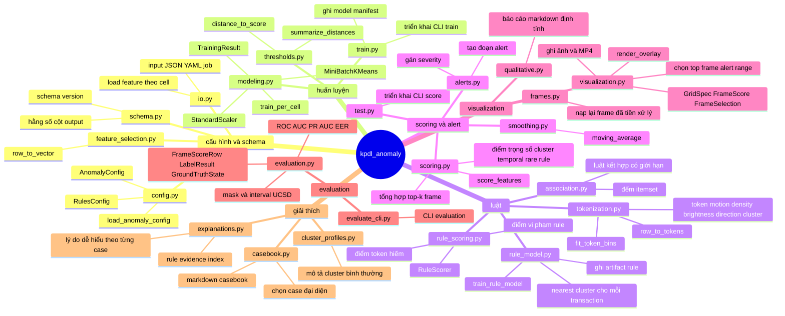
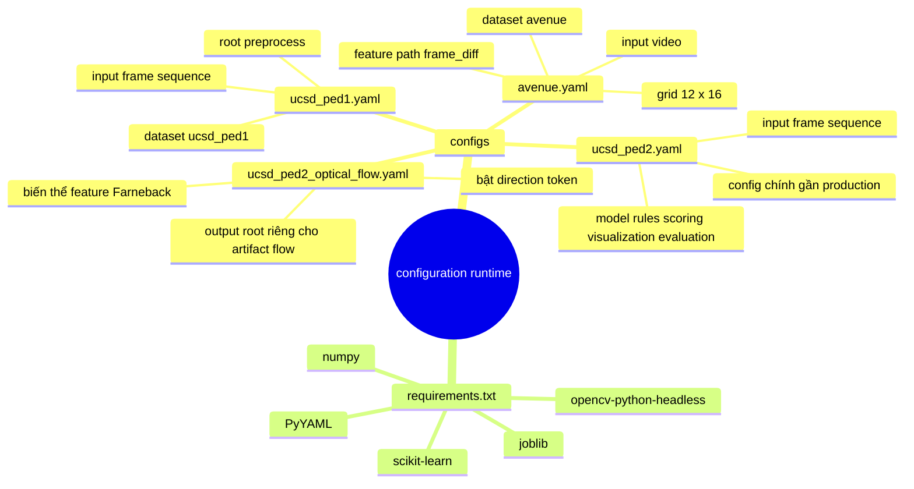
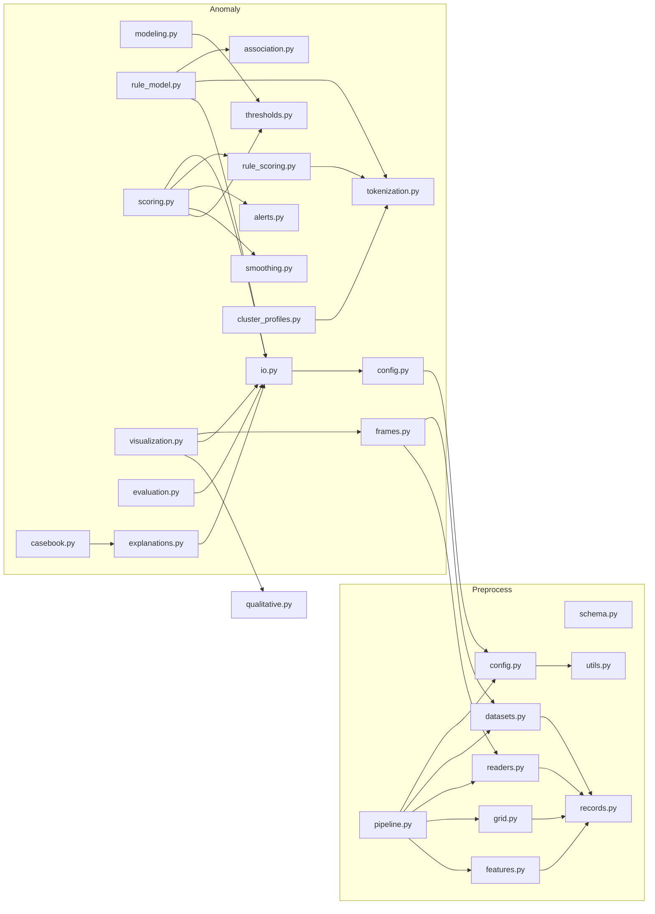
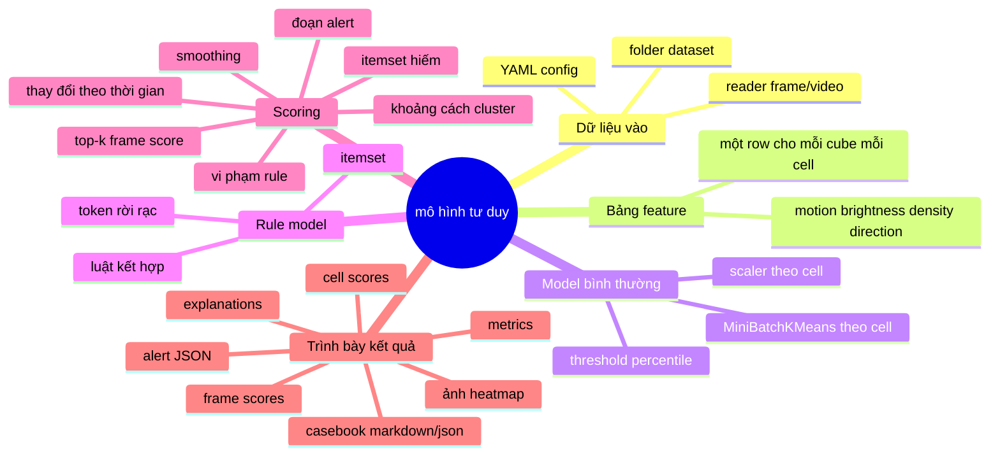

# Mindmap Code - Dự Án KPDL Anomaly Detection

Tài liệu này dùng để rà soát kiến trúc code của repository. Phạm vi bao gồm source code, CLI wrapper, file cấu hình và file dependency runtime trong `src/`. Các file dataset, output sinh ra, PDF, file build LaTeX và `repomix-output.xml` được cố ý loại khỏi mindmap.

## 1. Bức Tranh Tổng Quan

## 2. Luồng Pipeline

```mermaid
flowchart TD
    A["src/preprocess.py"] --> B["kpdl_preprocess.cli"]
    B --> C["kpdl_preprocess.pipeline.run_preprocess"]
    C --> D["datasets.scan_dataset"]
    C --> E["grid.generate_grid"]
    C --> F["readers.iter_preprocessed_frames"]
    F --> G["readers.preprocess_frame"]
    C --> H["features.extract_cube_features"]
    C --> I["features_train.csv / features_test.csv"]
    C --> J["frames_manifest.csv / videos_manifest.csv / preprocess_stats.json"]

    L["src/train.py"] --> M["kpdl_anomaly.train.run_train"]
    M --> N["io.load_features_by_cell"]
    M --> O["modeling.train_per_cell"]
    O --> P["thresholds.summarize_distances"]
    M --> Q["cell_models.joblib / cell_scalers.joblib / thresholds.json"]

    R["src/rules.py"] --> S["rule_model.train_rule_model"]
    S --> T["tokenization.fit_token_bins"]
    S --> U["tokenization.row_to_tokens"]
    S --> V["association.update_itemset_counts"]
    V --> W["association.generate_association_rules"]
    S --> X["rules.json / itemsets.json / token_bins.json"]

    Y["src/test.py"] --> Z["kpdl_anomaly.test.run_test"]
    Z --> AA["scoring.score_features"]
    AA --> AB["feature_selection.row_to_vector"]
    AA --> AC["rule_scoring.load_rule_scorer"]
    AC --> AD["RuleScorer.score"]
    AA --> AE["smoothing.moving_average"]
    AA --> AF["alerts.assign_severities và build_alerts"]
    AA --> AG["cell_scores.csv / frame_scores.csv / alerts.json"]

    AH["src/visualize.py"] --> AI["visualization.run_visualization"]
    AI --> AJ["frames.load_preprocessed_frames"]
    AI --> AK["visualization.render_overlay"]
    AI --> AL["qualitative.write_qualitative_report"]

    AM["src/evaluate.py"] --> AN["evaluation.evaluate_results"]
    AN --> AO["Mask hoặc interval UCSD"]
    AN --> AP["metrics.json / frame_labels.csv"]

    AQ["src/explain.py"] --> AR["cluster_profiles.generate_cluster_profiles"]
    AQ --> AS["explanations.write_rule_evidence_index"]
    AQ --> AT["casebook.generate_casebook"]
```

## 3. File CLI Và Wrapper

### Ghi Chú Từng File

| File | Vai trò | Hàm chính | Input chính | Output chính |
|---|---|---|---|---|
| `src/preprocess.py` | Wrapper thực thi tối giản cho tiền xử lý. | `main` import từ `kpdl_preprocess.cli` | CLI args | Exit code và summary tiền xử lý in ra terminal |
| `src/train.py` | Wrapper thực thi tối giản cho train model. | `main` import từ `kpdl_anomaly.train` | CLI args | Artifact model dưới model root đã cấu hình |
| `src/test.py` | Wrapper thực thi tối giản cho scoring. | `main` import từ `kpdl_anomaly.test` | CLI args | Artifact kết quả dưới result root đã cấu hình |
| `src/evaluate.py` | Wrapper thực thi tối giản cho metric. | `main` import từ `kpdl_anomaly.evaluate_cli` | CLI args | Artifact evaluation |
| `src/rules.py` | CLI khai phá luật có hỗ trợ override tham số. | `build_parser`, `main`, `run_rules`, `_with_overrides`, `_public_summary` | Config, model dir, override support/confidence/lift, giới hạn row | `rules.json`, `itemsets.json`, `token_bins.json`, summary JSON |
| `src/visualize.py` | CLI visualization cho top frame, alert peak và overlay theo video/khoảng frame. | `build_parser`, `main`, `_public_summary` | Config, result dir, output dir, tham số chọn frame | Ảnh, MP4 overlay, index và stats |
| `src/explain.py` | CLI analysis nối cluster profile, rule evidence và alert casebook. | `build_parser`, `main`, `run_explain`, `_cluster_only_manifest`, `_public_summary` | Config, model/rule/result/visualization dir | `cluster_profiles`, `rule_evidence_index`, `alert_casebook`, analysis manifest |
| `src/tool/_common.py` | Helper dùng chung cho script preprocess theo dataset. | `add_common_args`, `run_dataset`, `_summary` | CLI args đã parse và config path | Summary của lần chạy preprocess |
| `src/tool/preprocess_ucsd.py` | CLI tiện dụng cho tiền xử lý UCSD Ped2. | `build_parser`, `main` | Shared preprocess args | Artifact tiền xử lý UCSD Ped2 |
| `src/tool/preprocess_avenue.py` | CLI tiện dụng cho tiền xử lý CUHK Avenue. | `build_parser`, `main` | Shared preprocess args | Artifact tiền xử lý Avenue |
| `src/tool/__init__.py` | File đánh dấu package rỗng cho tool script. | none | none | Định danh import/package |

## 4. Mindmap Package Tiền Xử Lý

### Ghi Chú Từng File

| File | Vai trò | Hàm/class chính | Chi tiết quan trọng |
|---|---|---|---|
| `src/kpdl_preprocess/__init__.py` | File đánh dấu package và định danh nhẹ. | none | Giúp import code tiền xử lý bằng `kpdl_preprocess`. |
| `src/kpdl_preprocess/config.py` | Loader và validator YAML cho tiền xử lý. | `ConfigError`, `load_config`, `_validate_config`, `get_nested`, `copy_config`, `resolve_path` | Validate các section như `data`, `video`, `grid`, `cube`, `features`, `output`; resolve path tương đối theo project root. |
| `src/kpdl_preprocess/datasets.py` | Tìm nguồn video train/test từ config. | `scan_dataset`, `_scan_frame_sequences`, `_scan_videos` | Hỗ trợ `frame_sequence` và `video`; frame sequence hiện quét `*.tif`; video quét `.avi`, `.mp4`, `.mov`, `.mkv`. |
| `src/kpdl_preprocess/readers.py` | Load frame thô và chuẩn hóa frame. | `_cv2`, `iter_preprocessed_frames`, `probe_video`, `_iter_frame_sequence`, `_iter_video`, `preprocess_frame`, `_video_safety_limit` | Dùng OpenCV, resize, chuyển grayscale, Gaussian blur tùy chọn, cân bằng histogram tùy chọn, timestamp frame và guard chống đọc video vô hạn. |
| `src/kpdl_preprocess/grid.py` | Tạo grid không gian cố định. | `generate_grid`, `grid_to_json` | Sinh `CellRecord` có `cell_id`, row/col, bounding box; serialize metadata grid. |
| `src/kpdl_preprocess/records.py` | Dataclass dùng chung trong tiền xử lý. | `VideoSource`, `FrameRecord`, `CellRecord.width`, `CellRecord.height` | Giữ metadata dataset/split/video, frame grayscale đã tiền xử lý và hình học cell. |
| `src/kpdl_preprocess/schema.py` | Hợp đồng schema CSV cho output tiền xử lý. | `feature_columns` | Định nghĩa `FRAME_MANIFEST_COLUMNS`, `VIDEO_MANIFEST_COLUMNS`, cột feature cơ bản và mở rộng `direction_hist_*`. |
| `src/kpdl_preprocess/features.py` | Chuyển cube không gian-thời gian thành feature row theo cell. | `extract_cube_features`, `_farneback_motion`, `_cell_direction_histogram`, `_safe_mean`, `_safe_std` | Trích xuất foreground ratio, motion mean/std/density, direction histogram, brightness mean/delta; hỗ trợ `frame_diff` và `farneback`. |
| `src/kpdl_preprocess/pipeline.py` | Điều phối chính của bước tiền xử lý. | `run_preprocess`, `_process_source`, `_frame_manifest_row`, `_limit_sources_per_split`, `_new_stats`, `_empty_split_stats`, `_finalize_stats`, `_expected_frame_count` | Ghi `grid.json`, `features_train.csv`, `features_test.csv`, manifest và stats; dùng deque làm cube buffer. |
| `src/kpdl_preprocess/cli.py` | CLI tiền xử lý tổng quát. | `build_parser`, `main`, `_public_stats` | Expose config, project root, split, limit và progress logging. |
| `src/kpdl_preprocess/utils.py` | Helper nhỏ dùng chung. | `ensure_dir`, `natural_key`, `sorted_natural`, `stem_to_frame_id`, `bool_config` | Dùng khi quét dataset, tạo output, lấy frame id và ép kiểu config. |

## 5. Mindmap Package Phát Hiện Bất Thường

### Ghi Chú Từng File

| File | Vai trò | Hàm/class chính | Chi tiết quan trọng |
|---|---|---|---|
| `src/kpdl_anomaly/__init__.py` | File đánh dấu package. | none | Giúp import các module anomaly bằng `kpdl_anomaly`. |
| `src/kpdl_anomaly/config.py` | Chuyển YAML thô thành cấu hình anomaly có kiểu rõ hơn. | `RulesConfig`, `AnomalyConfig`, `load_anomaly_config`, `_positive_int`, `_probability` | Resolve feature path, model/result/rule/visualization/evaluation root, trọng số scoring, threshold alert và tham số rule. |
| `src/kpdl_anomaly/schema.py` | Hợp đồng cột và schema cho output anomaly. | constants only | Định nghĩa schema version cho model/rule, cột metadata, feature mặc định, cột cell score, cột frame score và cột rule score. |
| `src/kpdl_anomaly/io.py` | Utility IO và load feature dùng chung. | `FeatureLoadResult`, `require_files`, `read_json`, `write_json`, `write_config_yaml`, `validate_feature_header`, `load_features_by_cell`, `output_dir` | Gom validation file, ghi JSON, ghi snapshot YAML và load row train theo cell. |
| `src/kpdl_anomaly/feature_selection.py` | Chuyển row CSV thành vector số. | `row_to_vector` | Trả `None` khi row có feature không hợp lệ/không phải số; dùng trong train/rule/scoring. |
| `src/kpdl_anomaly/train.py` | Triển khai CLI train. | `build_parser`, `main`, `run_train`, `_expected_rows`, `_public_summary` | Load train features, train model theo cell, ghi `cell_models.joblib`, `cell_scalers.joblib`, `thresholds.json`, `feature_stats.json`, `model_manifest.json`. |
| `src/kpdl_anomaly/modeling.py` | Logic train model thật theo từng cell. | `TrainingResult`, `train_per_cell`, `_fallback_threshold` | Fit `StandardScaler` và `MiniBatchKMeans` theo cell; xử lý cell ít mẫu/fallback; tính phân phối khoảng cách. |
| `src/kpdl_anomaly/thresholds.py` | Tóm tắt phân phối khoảng cách và chuẩn hóa score. | `summarize_distances`, `distance_to_score` | Chuyển cluster distance thô thành anomaly score bị chặn theo threshold percentile. |
| `src/kpdl_anomaly/test.py` | Triển khai CLI scoring. | `build_parser`, `main`, `run_test`, `_public_summary` | Resolve model/rule dir và chuyển tiếp sang `score_features`. |
| `src/kpdl_anomaly/scoring.py` | Engine scoring bất thường chính. | `score_features`, `_validate_manifest`, `_score_weights`, `_score_row`, `_frame_records`, `_smooth_and_label`, `_stats` | Kết hợp cluster distance, temporal change, rare-token score và rule-violation score; tổng hợp top-k cell thành frame score; ghi `cell_scores.csv`, `frame_scores.csv`, `alerts.json`, `scoring_stats.json`. |
| `src/kpdl_anomaly/smoothing.py` | Primitive làm mượt theo thời gian. | `moving_average` | Áp dụng moving average lên frame score trước khi gán alert. |
| `src/kpdl_anomaly/alerts.py` | Chuyển frame score đã làm mượt thành đoạn cảnh báo. | `assign_severities`, `_mark_runs`, `_apply_run`, `build_alerts`, `_flush_segment`, `_reasons` | Yêu cầu vượt threshold liên tiếp; tạo lý do alert từ top cell, nearest cluster và token/rule reasons. |
| `src/kpdl_anomaly/tokenization.py` | Rời rạc hóa feature thành token. | `fit_token_bins`, `row_to_tokens`, `_motion_bucket`, `_three_bucket`, `_brightness_delta_bucket`, `_direction_bucket`, `_cluster_label` | Tạo token cho cell, row, col, motion, density, brightness, brightness delta, direction và cluster tùy config. |
| `src/kpdl_anomaly/association.py` | Đếm itemset có giới hạn và sinh luật kết hợp. | `update_itemset_counts`, `itemset_records`, `generate_association_rules`, `_position_only`, `_preferred_consequent` | Tạo record support/confidence/lift; lọc itemset chỉ mang thông tin vị trí kém hữu ích và ưu tiên consequent dễ diễn giải. |
| `src/kpdl_anomaly/rule_model.py` | Train rule model từ feature train bình thường. | `train_rule_model`, `_validate_model_manifest`, `_nearest_cluster`, `_transaction_record`, `_token_schema`, `_token_stats`, `_warnings`, `_write_selected_rules` | Load cluster đã train để thêm token `cluster=Cx`; ghi itemset, rule, bin, token stats, transaction tùy chọn và markdown rule được chọn. |
| `src/kpdl_anomaly/rule_scoring.py` | Load và áp dụng artifact rule trong lúc scoring. | `RuleScore`, `RuleLoadResult`, `RuleScorer`, `load_rule_scorer`, `_rare_candidates`, `_violation_reason` | Tính rare-token score từ itemset support thấp và rule-violation score từ consequent bị thiếu; trả về reason có thể giải thích. |
| `src/kpdl_anomaly/frames.py` | Nạp lại frame đã tiền xử lý để visualization. | `LoadedFrame`, `FrameBatch`, `load_preprocessed_frames`, `ensure_preprocessed_frame_source` | Dùng scanner/reader của preprocessing để lấy đúng các frame được yêu cầu từ split test. |
| `src/kpdl_anomaly/visualization.py` | Renderer heatmap và video overlay. | `GridCell`, `GridSpec`, `FrameScore`, `FrameSelection`, `VisualizationSettings`, `run_visualization`, `load_grid`, `load_frame_scores`, `select_top_frames`, `select_alert_peaks`, `select_video_range`, `render_overlay` | Chuyển cell score thành heatmap, blend lên frame, vẽ top cell/grid, ghi PNG, MP4 overlay, index, stats và qualitative report. |
| `src/kpdl_anomaly/qualitative.py` | Ghi summary visualization ở dạng dễ đọc. | `write_qualitative_report`, `_append_top_frames`, `_append_alerts`, `_append_videos`, `_markdown_link` | Sinh markdown liệt kê artifact top frame, ảnh alert và video đã tạo. |
| `src/kpdl_anomaly/evaluate_cli.py` | CLI cho evaluation một result. | `build_parser`, `main`, `_public_summary` | Tính metric frame-level từ `frame_scores.csv` và ground truth UCSD. |
| `src/kpdl_anomaly/evaluation.py` | Engine đánh giá frame-level. | `FrameScoreRow`, `LabelResult`, `GroundTruthState`, `evaluate_results`, `_load_ground_truth_state`, `_binary_metrics`, `_threshold_metrics` | Load interval `.m` của UCSD và/hoặc pixel mask, gán label cho frame đã score, tính ROC-AUC, PR-AUC, EER, stats threshold và markdown summary. |
| `src/kpdl_anomaly/cluster_profiles.py` | Chuyển cluster đã train thành profile normal pattern dễ diễn giải. | `TokenContext`, `generate_cluster_profiles`, `write_cluster_profiles_markdown`, `_inverse_centers`, `_cluster_record`, `_cluster_summary` | Inverse-transform centroid, gắn token context/support và mô tả cluster theo motion/density/brightness/cell. |
| `src/kpdl_anomaly/explanations.py` | Tạo rule evidence và explanation record theo case. | `RuleEvidenceResult`, `write_rule_evidence_index`, `load_cluster_profile_index`, `load_frame_scores`, `load_alerts`, `load_cell_scores_for_frames`, `build_explanation_record` | Join frame/cell score, cluster profile, rare itemset, rule bị vi phạm và câu chữ dễ hiểu. |
| `src/kpdl_anomaly/casebook.py` | Chọn case bất thường đại diện và ghi tài liệu casebook. | `generate_casebook`, `select_cases`, `write_casebook_markdown`, `_case_from_frame`, `_peak_frame_for_alert`, `_overlay_for_case`, `_analysis_manifest` | Chọn alert peak hoặc frame có score cao, link overlay, lưu placeholder review và evidence. |

## 6. File Config Và Runtime

### Ghi Chú Từng File

| File | Vai trò | Section chính | Chi tiết quan trọng |
|---|---|---|---|
| `src/configs/avenue.yaml` | Cấu hình dataset CUHK Avenue. | `data`, `video`, `grid`, `cube`, `features`, `output` | Dùng input dạng video cho Avenue; hữu ích khi mở rộng pipeline từ UCSD sang nguồn video. |
| `src/configs/ucsd_ped1.yaml` | Cấu hình dataset UCSD Ped1. | `data`, `video`, `grid`, `cube`, `features`, `output` | Tương tự setup preprocessing của Ped2 cho frame sequence, hữu ích khi mở rộng validation. |
| `src/configs/ucsd_ped2.yaml` | Cấu hình end-to-end chính. | `data`, `video`, `grid`, `cube`, `features`, `output`, `model`, `scoring`, `rules`, `visualization`, `evaluation` | Điều khiển artifact MVP chính: feature frame-diff, MiniBatchKMeans, scoring có trọng số, rule scoring, heatmap và evaluation. |
| `src/configs/ucsd_ped2_optical_flow.yaml` | Cấu hình optical-flow thay thế cho Ped2. | Giống Ped2 nhưng có thêm thiết lập Farneback | Bật feature/token có hướng mà không thay thế config frame-diff chính. |
| `src/requirements.txt` | Danh sách dependency runtime Python. | dependency và minimum version | Bao phủ array, OpenCV IO/rendering, YAML, scikit-learn và joblib serialization. |

## 7. Quan Hệ Phụ Thuộc Giữa Các File

## 8. Thứ Tự Đọc Cho Người Mới Vào Dự Án

1. Đọc `src/doc/prd.md` để nắm ý định sản phẩm.
2. Đọc `src/configs/ucsd_ped2.yaml` để hiểu cấu hình end-to-end đang dùng.
3. Theo luồng tiền xử lý: `src/preprocess.py` -> `src/kpdl_preprocess/cli.py` -> `src/kpdl_preprocess/pipeline.py`.
4. Theo luồng trích xuất feature: `src/kpdl_preprocess/readers.py`, `src/kpdl_preprocess/grid.py`, `src/kpdl_preprocess/features.py`.
5. Theo luồng train model: `src/train.py` -> `src/kpdl_anomaly/train.py` -> `src/kpdl_anomaly/modeling.py`.
6. Theo luồng rule: `src/rules.py` -> `src/kpdl_anomaly/rule_model.py` -> `src/kpdl_anomaly/tokenization.py` -> `src/kpdl_anomaly/association.py`.
7. Theo luồng scoring: `src/test.py` -> `src/kpdl_anomaly/test.py` -> `src/kpdl_anomaly/scoring.py` -> `src/kpdl_anomaly/alerts.py`.
8. Theo luồng output: `src/visualize.py`, `src/evaluate.py`, `src/explain.py`.

## 9. Mô Hình Tư Duy Nhanh

