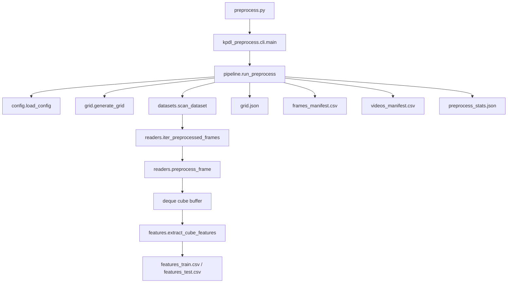

# Tài Liệu Chi Tiết Tiền Xử Lý Dữ Liệu

Tài liệu này giải thích luồng tiền xử lý dữ liệu theo code hiện tại. Mọi đường dẫn code và output trong tài liệu này được hiểu tương đối từ root `src/`. Ví dụ `kpdl_preprocess/pipeline.py` là file `kpdl_preprocess/pipeline.py` khi đang đứng trong root `src`.

## 1. Mục Tiêu Của Bước Tiền Xử Lý

Tiền xử lý biến dữ liệu camera thô thành bảng đặc trưng có cấu trúc để các bước sau có thể huấn luyện phân cụm, khai phá luật, chấm điểm bất thường và vẽ heatmap.

Input chính có hai dạng:

- Chuỗi frame ảnh, ví dụ UCSD Ped1/Ped2 với các file `.tif`.
- File video, ví dụ CUHK Avenue với các file `.avi`.

Output chính là các file CSV/JSON trong `outputs/preprocessed/<dataset>/`. Code hiện tại không lưu lại ảnh/frame đã chuẩn hóa ra đĩa và không sinh ARFF cho WEKA.

## 2. File Code Tham Gia Tiền Xử Lý

| File                          | Vai trò |
|-------------------------------|-------------------------------------------------------------------------------------------------------------------------------------|
| `preprocess.py`               | Entrypoint mỏng khi chạy `python preprocess.py ...` từ root `src/`. File này thêm thư mục chứa nó vào `sys.path` rồi gọi CLI thật.  |
| `kpdl_preprocess/cli.py`      | Định nghĩa tham số dòng lệnh và gọi `run_preprocess`.                                                                               |
| `kpdl_preprocess/config.py`   | Đọc YAML, validate các section bắt buộc và resolve đường dẫn tương đối theo project root.                                           |
| `kpdl_preprocess/datasets.py` | Quét dataset train/test để tạo danh sách `VideoSource`.                                                                             |
| `kpdl_preprocess/readers.py`  | Đọc frame từ chuỗi ảnh hoặc video bằng OpenCV, resize, grayscale, blur, normalize sáng nếu bật.                                     |
| `kpdl_preprocess/records.py`  | Định nghĩa dataclass `VideoSource`, `FrameRecord`, `CellRecord`.                                                                    |
| `kpdl_preprocess/grid.py`     | Chia frame resize thành grid cell cố định và serialize sang `grid.json`.                                                            |
| `kpdl_preprocess/features.py` | Trích xuất feature chuyển động, mật độ, hướng và độ sáng cho từng cube/cell.                                                        |
| `kpdl_preprocess/schema.py`   | Định nghĩa schema cột cho manifest và feature CSV.                                                                                  |
| `kpdl_preprocess/pipeline.py` | Điều phối toàn bộ quy trình: load config, tạo grid, quét dataset, đọc frame, tạo cube, ghi output.                                  |
| `kpdl_preprocess/utils.py`    | Helper tạo thư mục, sort tự nhiên, parse frame id, parse boolean config.                                                            |
| `tool/_common.py`             | Helper chung cho script tiện dụng theo dataset.                                                                                     |
| `tool/preprocess_ucsd.py`     | Wrapper tiện dụng cho UCSD Ped1/Ped2.                                                                                               |
| `tool/preprocess_avenue.py`   | Wrapper tiện dụng cho CUHK Avenue.                                                                                                  |

## 3. Cách Chạy

Chạy từ root `src/`:

```bash
python preprocess.py --config configs/ucsd_ped2.yaml
```

Các option được khai báo ở `kpdl_preprocess/cli.py`:

| Option                | Ý nghĩa                                                       |
|-----------------------|---------------------------------------------------------------|
| `--config`            | Đường dẫn YAML config, bắt buộc.                              |
| `--project-root`      | Root để resolve path dataset/output. Mặc định là thư mục `src`, nên có thể đứng trong `src` để chạy toàn bộ lệnh. |
| `--output-root`       | Ghi đè `output.root` trong config.                            |
| `--split train/test`  | Chỉ xử lý một split. Nếu bỏ trống sẽ xử lý cả train và test. |
| `--limit-videos`      | Giới hạn số video/sequence mỗi split để smoke test. |
| `--limit-frames`      | Giới hạn số frame mỗi video/sequence để smoke test.           |
| `--progress-every`    | In tiến độ sau mỗi N frame. Đặt `0` để tắt.                   |

Code hiện tại không còn option `--export-arff`.

## 4. Cấu Hình Đầu Vào

Ví dụ chính là `configs/ucsd_ped2.yaml`.

Các section bắt buộc được validate trong `kpdl_preprocess/config.py`:

| Section     | Trường quan trọng                                                                                   |
|-------------|-----------------------------------------------------------------------------------------------------|
| `data`      | `dataset`, `root`, `train_path`, `test_path`                                                        |
| `video`     | `input_type`, `resize_width`, `resize_height`, `blur`, `brightness_normalization`                   |
| `grid`      | `rows`, `cols`, `ignore_cells`                                                                      |
| `cube`      | `length`, `stride`                                                                                  |
| `features`  | `motion_method`, `frame_diff_threshold`, `direction_bins`, cấu hình Farneback nếu dùng optical flow |
| `output`    | `root`, cùng các output root cho bước sau như model/result                                          |

`video.input_type` chỉ nhận:

- `frame_sequence`: dataset là nhiều thư mục ảnh.
- `video`: dataset là các file video.

`features.motion_method` hiện hỗ trợ:

- `frame_diff` hoặc `frame_difference`.
- `farneback`, `optical_flow` hoặc `flow`.

## 5. Luồng Tổng Quát

Luồng chính nằm trong `kpdl_preprocess/pipeline.py`, hàm `run_preprocess`.



Các bước thực thi:

1. Đọc và validate YAML config.
2. Resolve output directory: `output.root/<dataset>`.
3. Tạo grid cell theo kích thước frame resize.
4. Ghi `grid.json`.
5. Quét train/test source từ dataset.
6. Mở các file output CSV.
7. Với từng source, đọc từng frame đã chuẩn hóa.
8. Ghi metadata frame vào `frames_manifest.csv`.
9. Đưa frame vào buffer dạng `deque` để tạo cube trượt.
10. Khi đủ `cube.length`, trích feature cho mọi cell.
11. Ghi feature vào `features_train.csv` hoặc `features_test.csv`.
12. Ghi metadata source vào `videos_manifest.csv`.
13. Tổng hợp thống kê và ghi `preprocess_stats.json`.

## 6. Quét Dataset

Code quét dataset nằm ở `kpdl_preprocess/datasets.py`.

Hàm chính:

- `scan_dataset(config, project_root, split_filter=None)`
- `_scan_frame_sequences(...)`
- `_scan_videos(...)`

### 6.1. Dataset Dạng Frame Sequence

Khi `video.input_type = "frame_sequence"`, code đi vào `_scan_frame_sequences`.

Logic:

- Vào `data.root / data.train_path` và `data.root / data.test_path`.
- Mỗi thư mục con có file `.tif` được xem là một sequence.
- Thư mục có đuôi `_gt` bị bỏ qua vì đó là ground truth, không phải input feature.
- Tạo một `VideoSource` cho mỗi sequence.

Ví dụ UCSD Ped2:

```text
dataset root:
  dataset = ucsd_ped2
  root = dataset/UCSD_Anomaly_Dataset.v1p2/UCSDped2

train:
  Train/Train001/*.tif
  Train/Train002/*.tif

test:
  Test/Test001/*.tif
  Test/Test001_gt/     <-- bỏ qua khi preprocess
```

### 6.2. Dataset Dạng Video

Khi `video.input_type = "video"`, code đi vào `_scan_videos`.

Các đuôi được nhận:

```text
.avi, .mp4, .mov, .mkv
```

Mỗi file video được biến thành một `VideoSource`:

```text
dataset, split, video_id, source_path, input_type
```

Với Avenue, `video_id` là tên file không có phần mở rộng.

## 7. Các Record Nội Bộ

Dataclass nằm ở `kpdl_preprocess/records.py`.

### 7.1. VideoSource

Đại diện cho một video hoặc một sequence ảnh.

```text
dataset
split
video_id
source_path
input_type
```

`VideoSource` là đơn vị input cấp cao nhất mà pipeline xử lý.

### 7.2. FrameRecord

Đại diện cho một frame sau khi đã đọc và chuẩn hóa.

```text
dataset
split
video_id
frame_id
timestamp
source_path
original_width
original_height
resized_width
resized_height
gray
```

Trường `gray` là ma trận ảnh grayscale sau resize/blur/normalize. Trường này chỉ dùng trong RAM để tạo cube và trích feature, không được ghi ra file ảnh.

### 7.3. CellRecord

Đại diện cho một ô trong grid.

```text
cell_id
row
col
x1
y1
x2
y2
width
height
```

`width` và `height` là property tính từ tọa độ.

## 8. Đọc Và Chuẩn Hóa Frame

Code nằm ở `kpdl_preprocess/readers.py`.

Hàm điều phối:

```text
iter_preprocessed_frames(source, config, limit_frames=None)
```

Nếu source là frame sequence, gọi `_iter_frame_sequence`.
Nếu source là video, gọi `_iter_video`.

### 8.1. Đọc Chuỗi Ảnh

Hàm `_iter_frame_sequence`:

1. Lấy danh sách `*.tif`.
2. Sort tự nhiên bằng `utils.sorted_natural`.
3. Nếu có `limit_frames`, cắt danh sách theo giới hạn.
4. Đọc từng ảnh bằng `cv2.imread(..., cv2.IMREAD_UNCHANGED)`.
5. Gọi `preprocess_frame`.
6. Trả về `FrameRecord`.

`frame_id` được lấy từ số trong tên file bằng `utils.stem_to_frame_id`. Nếu tên file không có số, dùng fallback là index đọc.

### 8.2. Đọc Video

Hàm `_iter_video`:

1. Mở video bằng `cv2.VideoCapture`.
2. Đọc FPS và frame count hint nếu có.
3. Tạo safety limit bằng `_video_safety_limit` để tránh đọc vô hạn khi metadata video lỗi.
4. Lặp `cap.read()` từng frame.
5. Dừng nếu hết video, vượt `limit_frames`, hoặc vượt safety limit.
6. Gọi `preprocess_frame`.
7. Trả về `FrameRecord`.

`frame_id` của video bắt đầu từ `1`.

`timestamp` được tính:

```text
timestamp = frame_index / fps
```

Nếu FPS không hợp lệ thì timestamp là `None`.

### 8.3. Probe Video

Hàm `probe_video` lấy metadata video trước khi xử lý:

```text
fps
num_frames_hint
original_width
original_height
```

Các giá trị này được ghi vào `videos_manifest.csv` nếu lấy được.

### 8.4. Chuẩn Hóa Frame

Hàm `preprocess_frame` thực hiện:

1. Lấy `resize_width`, `resize_height` từ config.
2. Resize bằng `cv2.resize(..., interpolation=cv2.INTER_AREA)`.
3. Nếu ảnh đã grayscale thì giữ nguyên.
4. Nếu ảnh BGRA thì convert `BGRA2GRAY`.
5. Nếu ảnh BGR thì convert `BGR2GRAY`.
6. Ép kiểu về `uint8`.
7. Nếu `video.blur.enabled = true`, áp dụng Gaussian blur.
8. Nếu `video.brightness_normalization.enabled = true`, áp dụng `cv2.equalizeHist`.
9. Trả về ảnh grayscale, width gốc, height gốc.

Với config UCSD Ped2 hiện tại:

```yaml
video:
  resize_width: 320
  resize_height: 240
  blur:
    enabled: true
    kernel_size: 3
  brightness_normalization:
    enabled: false
```

Nghĩa là mỗi frame được resize về `320x240`, chuyển grayscale, blur nhẹ `3x3`, và không cân bằng sáng.

## 9. Tạo Grid Và Cell

Code nằm ở `kpdl_preprocess/grid.py`.

Hàm `generate_grid(width, height, rows, cols, ignore_cells=None)` chia frame resize thành lưới đều.

Với config:

```yaml
grid:
  rows: 12
  cols: 16
```

Số cell:

```text
12 * 16 = 192 cell
```

Nếu frame resize là `320x240`, mỗi cell xấp xỉ:

```text
cell_width = 320 / 16 = 20 px
cell_height = 240 / 12 = 20 px
```

`cell_id` có dạng:

```text
{row:02d}_{col:02d}
```

Ví dụ:

- `00_00`: góc trên trái.
- `00_15`: hàng đầu, cột cuối.
- `11_00`: hàng cuối, cột đầu.
- `11_15`: góc dưới phải.

Nếu config có `ignore_cells`, các cell có id tương ứng sẽ bị bỏ qua khi tạo grid.

Grid được ghi ra `grid.json` bằng `grid_to_json`.

## 10. Tạo Spatio-Temporal Cube

Cube được tạo trong `kpdl_preprocess/pipeline.py`, hàm `_process_source`.

Pipeline dùng:

```text
buffer = deque(maxlen=cube_length)
```

Mỗi frame đọc được sẽ được append vào buffer. Khi buffer đủ `cube.length`, code xét điều kiện stride:

```text
start_index = num_frames - cube_length
if start_index % cube_stride == 0:
    tạo cube
```

Với config hiện tại:

```yaml
cube:
  length: 5
  stride: 1
```

Cube đầu tiên gồm frame `1..5`, cube thứ hai gồm frame `2..6`, cube thứ ba gồm frame `3..7`, v.v.

Nếu một video có `N` frame, số cube lý tưởng là:

```text
num_cubes = floor((N - cube_length) / cube_stride) + 1
```

Với `length = 5`, `stride = 1`:

```text
num_cubes = N - 4
```

Mỗi cube sẽ được trích feature cho toàn bộ cell trong grid. Với 192 cell, mỗi cube tạo 192 dòng feature.

`cube_id` có dạng:

```text
{video_id}_{start_frame_id:06d}_{end_frame_id:06d}
```

Ví dụ:

```text
Train001_000001_000005
```

## 11. Trích Xuất Feature

Code nằm ở `kpdl_preprocess/features.py`, hàm `extract_cube_features`.

Input:

- `cube_id`
- danh sách `FrameRecord` trong cube
- danh sách `CellRecord`
- config

Output:

- danh sách dict, mỗi dict là một dòng feature cho một `cube + cell`.

### 11.1. Chuẩn Bị Frame Tensor

Code stack ảnh grayscale thành numpy array:

```text
frames shape = [cube_length, resized_height, resized_width]
```

Với `cube.length = 5`, `resize = 320x240`:

```text
frames shape = [5, 240, 320]
```

### 11.2. Motion Method: Frame Difference

Nếu `features.motion_method = frame_diff`, code tính:

```text
motion_values = abs(diff(frames, axis=0))
motion_masks = motion_values > frame_diff_threshold
direction_angles = None
```

Với `cube.length = 5`, `motion_values` có 4 lát thời gian vì chênh lệch được tính giữa các cặp frame liên tiếp.

Vì frame difference chỉ đo mức thay đổi sáng, nó không cho hướng chuyển động thật. Do đó direction histogram trong mode này sẽ là các giá trị `0.0`.

### 11.3. Motion Method: Farneback Optical Flow

Nếu `features.motion_method = farneback`, code gọi `_farneback_motion`.

Mỗi cặp frame liên tiếp được đưa vào:

```text
cv2.calcOpticalFlowFarneback(...)
```

Sau đó lấy:

```text
magnitude, angle = cv2.cartToPolar(flow[..., 0], flow[..., 1])
```

Kết quả:

- `motion_values`: độ lớn flow.
- `direction_angles`: góc hướng chuyển động.
- `motion_masks`: pixel có magnitude vượt `flow_magnitude_threshold`.

Mode này có direction histogram thật và dùng được cho direction token ở bước rule.

### 11.4. Feature Theo Từng Cell

Với mỗi cell, code crop vùng ảnh:

```text
y1:y2, x1:x2
```

Sau đó tính:

| Feature                 | Cách hiểu                                                                           |
|-------------------------|-------------------------------------------------------------------------------------|
| `foreground_ratio`      | Tỷ lệ pixel trong cell từng có chuyển động ở ít nhất một lát thời gian của cube.    |
| `motion_density`        | Tỷ lệ pixel-thời gian trong cell vượt ngưỡng chuyển động.                           |
| `motion_magnitude_mean` | Trung bình độ lớn chuyển động trong cell.                                           |
| `motion_magnitude_std`  | Độ lệch chuẩn độ lớn chuyển động trong cell.                                        |
| `brightness_mean`       | Độ sáng trung bình của cell ở frame giữa cube.                                      |
| `brightness_delta`      | Độ sáng trung bình frame cuối trừ frame đầu trong cell.                             |
| `direction_hist_0..N`   | Histogram hướng chuyển động, có trọng số theo magnitude; bằng 0 nếu không có angle. |

Frame giữa cube được lấy bằng:

```text
center = cube[len(cube) // 2]
```

Với cube 5 frame, center là frame thứ 3 trong cube.

## 12. Schema Feature CSV

Schema nằm ở `kpdl_preprocess/schema.py`.

Các cột feature:

```text
dataset
split
video_id
cube_id
start_frame_id
end_frame_id
center_frame_id
cell_id
cell_row
cell_col
foreground_ratio
motion_magnitude_mean
motion_magnitude_std
motion_density
direction_hist_0
direction_hist_1
direction_hist_2
direction_hist_3
direction_hist_4
direction_hist_5
direction_hist_6
direction_hist_7
brightness_mean
brightness_delta
```

Số cột `direction_hist_*` phụ thuộc `features.direction_bins`. Config hiện tại dùng `8`, nên có `direction_hist_0` đến `direction_hist_7`.

## 13. Output Sau Tiền Xử Lý

Output mặc định theo config, nhìn từ root `src/`:

```text
outputs/preprocessed/<dataset>/
```

Ví dụ:

```text
outputs/preprocessed/ucsd_ped2/
  grid.json
  features_train.csv
  features_test.csv
  frames_manifest.csv
  videos_manifest.csv
  preprocess_stats.json
```

### 13.1. `grid.json`

Sinh tại `kpdl_preprocess/pipeline.py` sau khi gọi `generate_grid`.

Chức năng:

- Lưu kích thước frame resize.
- Lưu số rows/cols.
- Lưu danh sách cell và tọa độ từng cell.
- Là mapping để các bước sau biết `cell_id` nằm ở vùng nào trên ảnh.

Nội dung logic:

```text
resized_width
resized_height
rows
cols
num_cells
cells:
  cell_id
  row
  col
  x1
  y1
  x2
  y2
  width
  height
```

Dùng bởi:

- Bước visualization để vẽ heatmap đúng vị trí.
- Bước explain/casebook để liên hệ cell bất thường với vùng ảnh.

### 13.2. `features_train.csv`

Sinh trong `kpdl_preprocess/pipeline.py` khi split là `train`.

Chức năng:

- Là dữ liệu feature dùng để học normal pattern.
- Là input cho `train.py` và `rules.py`.
- Mỗi dòng là một cell trong một cube.

Quan hệ số dòng:

```text
num_rows = num_train_cubes * num_cells
```

Nếu có `ignore_cells`, `num_cells` là số cell còn lại sau khi bỏ qua.

Ví dụ với 1 train sequence có 6 frame, `cube.length = 5`, `stride = 1`, `num_cells = 192`:

```text
num_cubes = 2
num_feature_rows = 2 * 192 = 384
```

### 13.3. `features_test.csv`

Sinh tương tự `features_train.csv`, nhưng cho split `test`.

Chức năng:

- Là dữ liệu feature để chấm điểm bất thường.
- Là input cho `test.py`.
- Có cùng schema với `features_train.csv`.

Điểm quan trọng: train và test không bị trộn. Pipeline ghi riêng `features_train.csv` và `features_test.csv`.

### 13.4. `frames_manifest.csv`

Mỗi dòng tương ứng một frame đã đọc và chuẩn hóa.

Schema nằm trong `FRAME_MANIFEST_COLUMNS` ở `kpdl_preprocess/schema.py`:

```text
dataset
split
video_id
frame_id
timestamp
source_path
original_width
original_height
resized_width
resized_height
```

Chức năng:

- Truy vết frame từ feature/result về file gốc.
- Biết frame thuộc video/sequence nào.
- Biết kích thước gốc và kích thước resize.
- Debug các lỗi đọc thiếu frame.

Với frame sequence, `source_path` là đường dẫn file ảnh `.tif`.
Với video, `source_path` là đường dẫn file video.

### 13.5. `videos_manifest.csv`

Mỗi dòng tương ứng một video hoặc một frame sequence.

Schema nằm trong `VIDEO_MANIFEST_COLUMNS` ở `kpdl_preprocess/schema.py`:

```text
dataset
split
video_id
source_path
input_type
fps
num_frames
num_cubes
original_width
original_height
failed
error
```

Chức năng:

- Tổng kết từng video/sequence đã xử lý.
- Ghi số frame đọc được.
- Ghi số cube tạo được.
- Ghi FPS nếu input là video và đọc được metadata.
- Ghi lỗi nếu source bị fail.

Nếu một video/sequence lỗi, pipeline vẫn ghi một dòng với:

```text
failed = True
error = nội dung exception
```

### 13.6. `preprocess_stats.json`

Sinh cuối cùng trong `kpdl_preprocess/pipeline.py`.

Chức năng:

- Tổng kết toàn bộ lần chạy preprocess.
- Lưu schema version.
- Lưu danh sách cột output.
- Lưu thông tin grid.
- Lưu thống kê theo split.

Nội dung chính:

```text
dataset
generated_at
config_path
schema:
  version
  frames_manifest_columns
  videos_manifest_columns
  feature_columns
grid:
  rows
  cols
  num_cells
  resized_width
  resized_height
splits:
  train/test:
    num_videos
    num_frames
    num_cubes
    num_cells
    num_feature_rows
    missing_frames
    failed_videos
    avg_motion_density
    avg_brightness
output_dir
```

File này dùng để kiểm tra nhanh lần chạy có hợp lệ không.

## 14. Công Thức Kiểm Tra Số Dòng Feature

Với mỗi source:

```text
num_cubes = floor((num_frames - cube_length) / cube_stride) + 1
```

Nếu `num_frames < cube_length`, `num_cubes = 0`.

Với mỗi split:

```text
num_feature_rows = tổng(num_cubes từng source) * num_cells
```

Ví dụ config UCSD Ped2:

```text
resize = 320x240
grid = 12x16
num_cells = 192
cube.length = 5
cube.stride = 1
```

Nếu một sequence có 200 frame:

```text
num_cubes = 200 - 4 = 196
feature rows = 196 * 192 = 37632
```

## 15. Sự Khác Nhau Giữa Frame Sequence Và Video

| Điểm                          | Frame sequence                                            | Video                                             |
|-------------------------------|-----------------------------------------------------------|---------------------------------------------------|
| Code đọc                      | `_iter_frame_sequence` trong `kpdl_preprocess/readers.py` | `_iter_video` trong `kpdl_preprocess/readers.py`  |
| Input                         | Nhiều file `.tif` trong một thư mục                       | Một file `.avi/.mp4/.mov/.mkv`                    |
| Frame id                      | Lấy từ tên file, fallback theo index                      | Tăng từ 1 theo thứ tự đọc                         |
| Timestamp                     | `index - 1`                                               | `frame_index / fps` nếu FPS hợp lệ                |
| Source path ở frame manifest  | File ảnh cụ thể                                           | File video                                        |
| Probe metadata                | Không có FPS/frame count hint                             | Lấy FPS, frame count, width, height bằng OpenCV   |
| Ground truth `_gt`            | Bỏ qua khi quét input                                     | Không áp dụng trong reader video                  |

Sau khi đã thành `FrameRecord`, hai dạng input được xử lý giống nhau: resize, grayscale, tạo cube, chia cell và trích feature.

## 16. Vì Sao Không Lưu Frame Đã Chuẩn Hóa

Pipeline hiện tại không ghi ảnh grayscale đã resize ra đĩa. Lý do:

- Bước train/test chỉ cần bảng feature CSV.
- Lưu frame trung gian sẽ tốn dung lượng lớn.
- Visualization có thể đọc lại frame từ dataset gốc và áp dụng cùng config khi cần.

Mapping cần thiết để truy vết vẫn được lưu trong `frames_manifest.csv`, `videos_manifest.csv` và `grid.json`.

## 17. Vì Sao Không Sinh ARFF

Nhánh ARFF/WEKA đã được gỡ khỏi code hiện tại để pipeline tập trung vào đề tài chính: phân cụm theo cell, token/rule, scoring, visualization và explanation.

Do đó sau preprocess hiện chỉ có:

```text
CSV + JSON manifest/stats
```

Không có:

```text
*.arff
```

Nếu trong workspace còn `outputs/weka/*.arff`, đó là artifact cũ, không phải output của code preprocess hiện tại.

## 18. Liên Hệ Với Các Bước Sau

Output preprocess được dùng như sau:

| Output preprocess       | Bước dùng sau                                                                               |
|-------------------------|---------------------------------------------------------------------------------------------|
| `features_train.csv`    | `train.py` học MiniBatchKMeans theo cell; `rules.py` học token/rule từ dữ liệu bình thường. |
| `features_test.csv`     | `test.py` chấm điểm bất thường cho từng cell/cube và frame.                                 |
| `grid.json`             | `visualize.py` vẽ heatmap theo đúng vùng cell.                                              |
| `frames_manifest.csv`   | Debug/truy vết frame và hỗ trợ kiểm tra dữ liệu đã đọc.                                     |
| `videos_manifest.csv`   | Kiểm tra từng video/sequence có đọc đủ và tạo cube thành công không.                        |
| `preprocess_stats.json` | Kiểm tra tổng quan schema, grid, số lượng frame/cube/feature row.                           |

## 19. Checklist Kiểm Tra Sau Khi Chạy Preprocess

Sau khi chạy xong, nên kiểm tra:

- Có đủ 6 file output: `grid.json`, `features_train.csv`, `features_test.csv`, `frames_manifest.csv`, `videos_manifest.csv`, `preprocess_stats.json`.
- `preprocess_stats.json` có `failed_videos = 0` hoặc lỗi được ghi rõ.
- `num_feature_rows` xấp xỉ `num_cubes * num_cells`.
- `features_train.csv` và `features_test.csv` có cùng header.
- `foreground_ratio` và `motion_density` nằm trong khoảng `[0, 1]`.
- `brightness_mean` nằm trong khoảng `[0, 255]`.
- `grid.num_cells` khớp với số cell mong muốn, ví dụ `12 * 16 = 192`.
- Nếu dùng `frame_diff`, `direction_hist_*` có thể toàn 0; đây là hành vi đúng của code hiện tại.
- Nếu cần direction thật, dùng config optical flow như `configs/ucsd_ped2_optical_flow.yaml`.

## 20. Ví Dụ Diễn Giải Một Dòng Feature

Một dòng trong `features_train.csv` có thể hiểu là:

```text
dataset = ucsd_ped2
split = train
video_id = Train001
cube_id = Train001_000001_000005
start_frame_id = 1
end_frame_id = 5
center_frame_id = 3
cell_id = 08_05
cell_row = 8
cell_col = 5
foreground_ratio = ...
motion_magnitude_mean = ...
motion_magnitude_std = ...
motion_density = ...
direction_hist_0..7 = ...
brightness_mean = ...
brightness_delta = ...
```

Nghĩa là: trong video/sequence `Train001`, xét cửa sổ frame 1 đến 5, lấy ô grid hàng 8 cột 5, rồi đo mức chuyển động, mật độ chuyển động, hướng và độ sáng của vùng đó.

Đây là đơn vị dữ liệu mà model sau này học normal pattern theo từng vùng camera.
